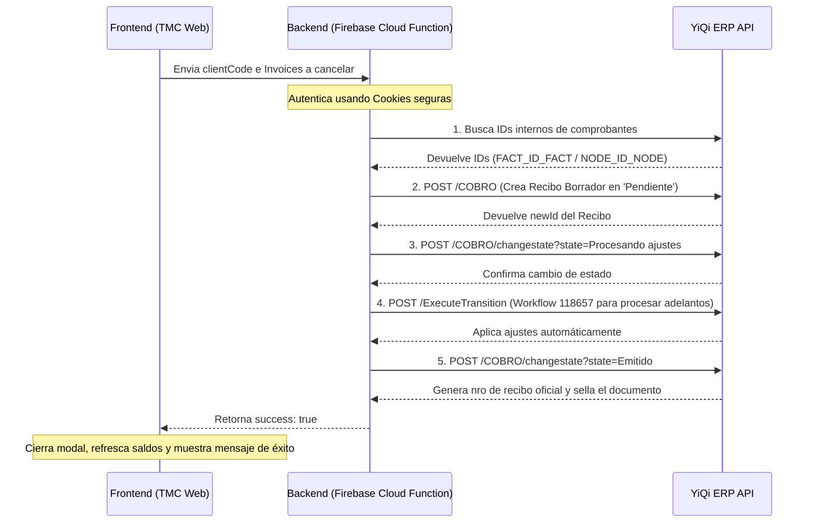

# Directrices de Seguridad y Arquitectura API: Modelo Proxy Backend para Aplicativos TMC 2.0

Este documento resume las lecciones aprendidas durante la integración con el ERP YiQi y establece los lineamientos arquitectónicos de seguridad para todo el suite de aplicativos de **TMC 2.0**.

---

## 1. El Patrón "Backend Proxy" (Por qué no llamar APIs desde el Navegador)

En el desarrollo de aplicaciones web internas, es muy común caer en la tentación de hacer llamados `fetch` directamente desde JavaScript en el navegador (Frontend) hacia las APIs de proveedores externos (como YiQi ERP, MercadoLibre, pasarelas de pago, etc.). 

Sin embargo, para aplicativos de grado empresarial esto es **inaceptable** debido a tres motivos fundamentales:

### A. Seguridad de Credenciales y Secretos
Para comunicarnos con cualquier API externa, requerimos credenciales (usuario/contraseña, tokens API, claves secretas). 
*   **Si lo hacemos en el Frontend**: Esas claves se escriben en el código JavaScript que se descarga en la computadora del usuario. Cualquier persona con conocimientos básicos puede abrir las Herramientas de Desarrollador (F12), ir a la pestaña Network o Sources, y copiar las credenciales.
*   **Si lo hacemos en el Backend (Cloud Functions)**: Las credenciales se guardan como variables de entorno seguras en la nube (ej: en Firebase Secrets). El código se ejecuta en un servidor cerrado y seguro. El navegador del usuario final jamás ve las credenciales.

### B. Evitar el Bloqueo de CORS (Cross-Origin Resource Sharing)
Por seguridad, los navegadores modernos implementan la política de mismo origen. Si tu web corre en `tmcrespo-app.web.app`, el navegador bloqueará cualquier petición directa a `yiqi.com.ar` a menos que el servidor de YiQi esté configurado para permitirlo explícitamente.
*   Al utilizar una Cloud Function como proxy, el navegador le hace la petición a nuestro backend (que sí tiene permitido el acceso de origen) y luego el backend se comunica por HTTP plano con YiQi. Los servidores no tienen restricciones de CORS.

### C. Atomicidad y Control de Transacciones Complejas
Muchas operaciones de negocio requieren ejecutar varios llamados encadenados. Por ejemplo, en la imputación FIFO:
1. Buscar el ID interno de la factura.
2. Crear un recibo borrador (`COBRO` en Pendiente).
3. Transicionar estado a `Procesando ajustes`.
4. Ejecutar el workflow `118657` para aplicar ajustes.
5. Transicionar estado a `Emitido`.

Si el navegador intentara realizar estas 5 llamadas y en la tercera llamada el usuario tiene una micro-desconexión en su celular o internet, el recibo quedaría creado en estado borrador de por vida y los saldos desincronizados. Al hacerlo en una Cloud Function de Firebase, la ejecución corre en la red troncal de Google en milisegundos de manera atómica. Si algo falla, el backend puede hacer un rollback o reportar el error de forma limpia.

---

## 2. Plan de Auditoría y Refactorización (Aplicativo por Aplicativo)

Para elevar los estándares de seguridad de toda la suite de TMC 2.0, realizaremos una revisión aplicativo por aplicativo bajo la siguiente lógica:

### Paso 1: Auditoría de Credenciales Hardcodeadas
*   Revisar todos los archivos `.html` y `.js` en el frontend buscando términos como `Authorization`, `Bearer`, `password`, `key`, `token`, `Cookie`.
*   Identificar si hay URLs de APIs externas apuntadas directamente.

### Paso 2: Diseño de Endpoints Proxy en el Backend
*   Por cada API externa expuesta, crear una Cloud Function en `tmc-backend/functions/index.js` (ej: `exports.mercadoLibreProxy`, `exports.imputarSaldoCliente`).
*   Mover las credenciales a las variables de entorno de Firebase Functions:
    ```bash
    firebase functions:secrets:set YIQI_PASSWORD="AdministracionMessi"
    ```

### Paso 3: Limpieza del Frontend
*   Reemplazar las llamadas directas a las APIs por llamadas a nuestras funciones seguras de Firebase (apuntando a `https://us-central1-tmc-backend-2f5c4.cloudfunctions.net/...`).
*   Asegurar que todas las llamadas complejas tengan spinner/loader discreto para notificar el estado al usuario contable.

---

## 3. Guía Rápida para el Flujo YiQi ERP (Recibos e Imputaciones)

El flujo definitivo y validado que debemos replicar en futuros módulos contables de YiQi es:

*Nota: Los números de recibo oficiales nunca se autogeneran en el borrador; se asignan en YiQi únicamente al pasar el recibo a estado `Emitido`.*
